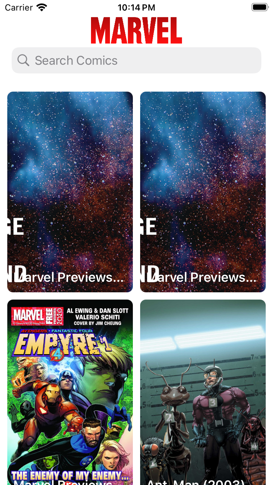
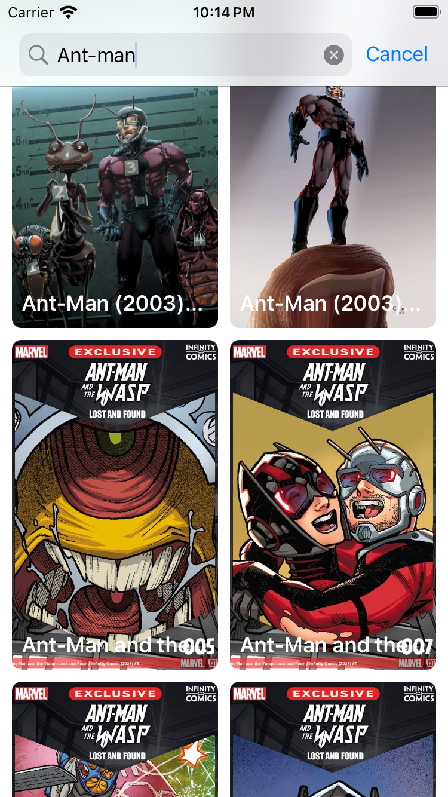
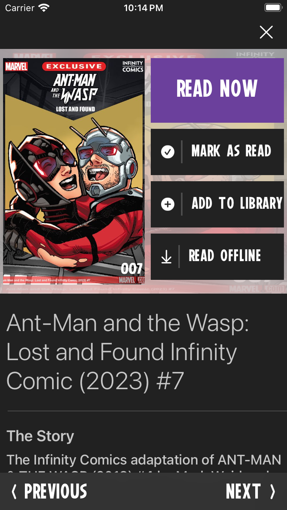
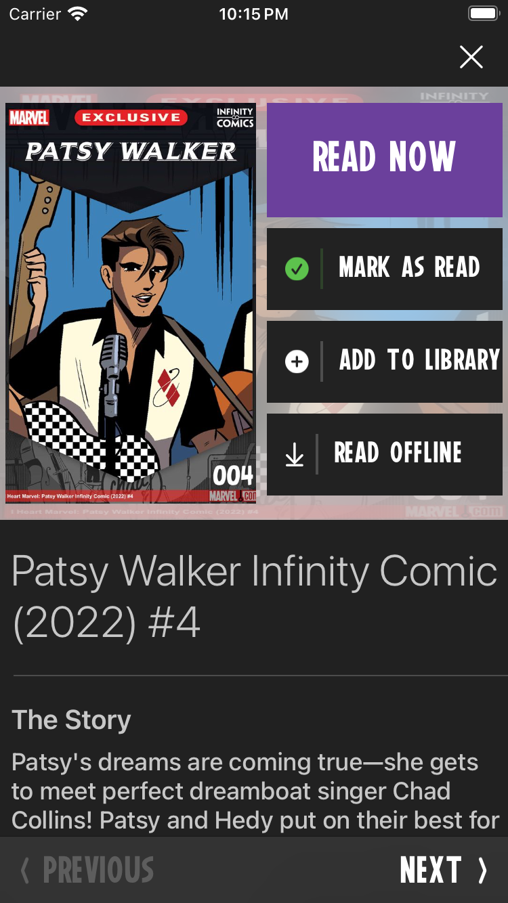
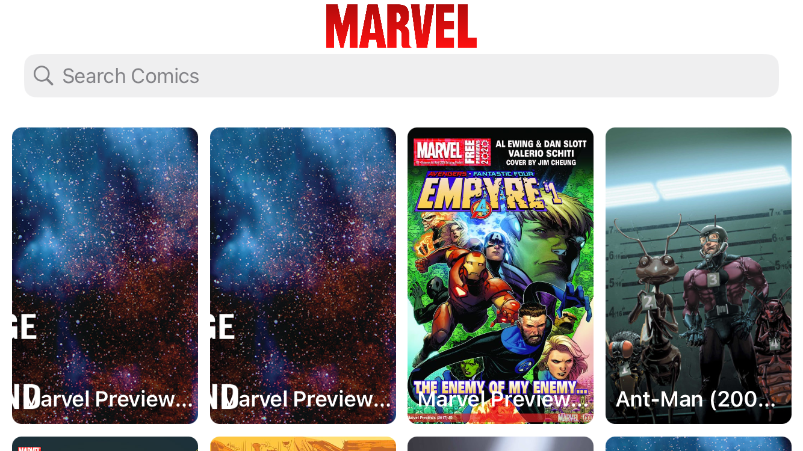
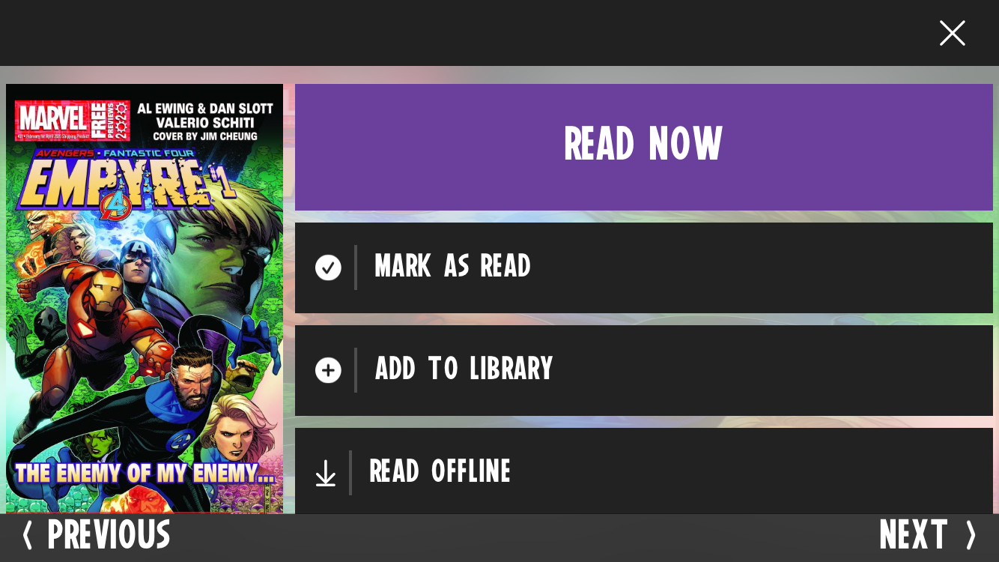

# Marvel Comics

## UI/UX

<center>

Demo |
:----------------------:|


Landing Page            |  Comics Search           |
:----------------------:|:-------------------------:
 | 

Comic Details           |  Mark As Read            |
:----------------------:|:-------------------------:
 | 

Landscape            |
:----------------------:|


Comic Details in Landscape |
:----------------------:|


</center>

## Developer API Keys

1. Obtain the keys: https://developer.marvel.com/account
2. Insert your Developer keys in [Core/Network/APIKeysSource.swift](MarvelComics-ios/Sources/Core/Network/APIKeysSource.swift):
```
let publicKey = "YOUR_PUBLIC_KEY"
let publicKey = "YOUR_PRIVATE_KEY"
```

## App Design

UIKit + MVVM + Combine + SwiftData

### 2 Main Controllers:
* Main Feed + Search: [ComicsCollectionViewController](./MarvelComics-ios/Sources/Screens/ComicsFeed/ComicsCollectionViewController.swift)
* Comic Details: [ComicsDetailsCollectionViewController](./MarvelComics-ios/Sources/Screens/ComicDetails/ComicsDetailsCollectionViewController.swift)

### Single ViewModel for both Controllers (due to almost identical data model & functionality)

* [ComicsViewModel](./MarvelComics-ios/Sources/Screens/ComicsFeed/ComicsViewModel.swift)

### Easy to Extend Network API

* Just inherit from [APIRequest](./MarvelComics-ios/Sources/Core/Network/APIRequest.swift), like [ComicsSearchAPIRequest](./MarvelComics-ios/Sources/Core/APIRequests/ComicsSearchAPIRequest.swift), and then call `fetch` on [APIService](./MarvelComics-ios/Sources/Core/Network/APIService.swift):
```
    let request = ComicsSearchAPIRequest(name: searchName, offset: offset)
    requestCancellable = APIService().fetch(for: request)
```

### Simple local DB to persist User's Data:

* [Storage](./MarvelComics-ios/Sources/Core/DataModel/Storage.swift)

### 3rd Party Libraries

None

## Tests

[Update Developer API Keys](#Developer-API-Keys) before runing tests

### Unit Tests

* [`Comic` Decoder](./MarvelComics-ios-Tests/Core/DataModel/Comic_Tests.swift)

### Functional Tests

* [Comic Details](./MarvelComics-ios-UITests/ComicDetails_UITests.swift)
    * `X/Close` button
    * `PREVIOUS/NEXT` buttons basic navigation
